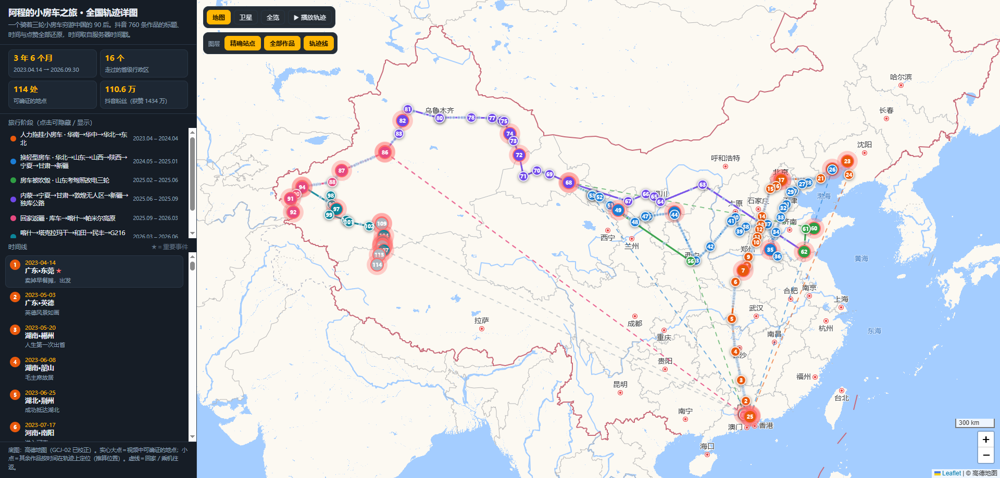

# 阿程的小房车之旅 · 全国轨迹地图

一个骑着三轮小房车穷游中国的 90 后户外博主「**阿程的小房车之旅**」（抖音号 64145813082）的完整旅行轨迹还原。

**时间跨度**：2023.04.14 – 2026.09.30（3 年 6 个月）
**覆盖范围**：16 个省级行政区
**数据来源**：抖音主页全部 760 条作品

---

## 在线查看

直接打开 `index.html` 即可（纯单文件，已内嵌 Leaflet，仅地图瓦片需要联网）。

如果本仓库启用了 GitHub Pages，可访问：
`https://nedved888.github.io/acheng-rv-journey-map/`

---

## 地图怎么看

| 图元 | 含义 |
|---|---|
| **带编号的实心大点** | 视频中**可确证**的地点，共 114 处。点开有日期、事件经过 |
| **★ 脉冲红圈** | 重大事件（出发、事故、救援、被狼群包围等） |
| **小圆点** | 其余作品按时间在相邻站点之间定位（**推算位置**），弹窗会写明它落在哪两站之间 |
| **实线** | 骑行路段 |
| **虚线** | 回家 / 乘机往返 |

**交互**：
- 顶栏可切换 `地图 / 卫星`，以及开关「精确站点 / 全部作品 / 轨迹线」三个图层
- 左侧按 7 个阶段分组，点击可单独隐藏某阶段
- 点时间线任意一条，地图会飞过去并弹出详情
- **▶ 播放轨迹** 按时间顺序逐段展开整条路线

---

## 七个阶段

| 阶段 | 时间 | 路线 |
|---|---|---|
| ① | 2023.04 – 2024.04 | 人力拖挂小房车：广东 → 湖南 → 湖北 → 河南 → 河北 → 北京 → 山海关 → 辽宁 |
| ② | 2024.05 – 2025.01 | 换轻型房车：华北 → 山东 → 山西 → 陕西 → 宁夏 → 甘肃 → 新疆 |
| ③ | 2025.02 – 2025.06 | 房车被大风吹毁报废 → 去山东考驾照、改电三轮房车 |
| ④ | 2025.06 – 2025.09 | 内蒙 → 宁夏 → 甘肃 → 敦煌 800 里无人区 → 新疆 → 独库公路 560 公里 |
| ⑤ | 2025.09 – 2026.03 | 回家返疆 → 库车 → 喀什 → 帕米尔高原（塔什库尔干） |
| ⑥ | 2026.03 – 2026.06 | 喀什 → 塔克拉玛干沙漠 → 和田 → 于田 → 民丰 → G216 羌塘无人区（第一次） |
| ⑦ | 2026.06 – 2026.09 | 回家返疆 → 反穿羌塘（进行中），最新位置：**美马错**（日土/改则交界，海拔 4920 米） |

---

## 重要事件

- **2023.04.14** 卖掉早餐摊，花不到 500 元买了辆自行车，退掉出租房出发
- **2023.12.04** 骑行 7 个多月抵达北京天安门
- **2023.12.20** 为扛住北方零下十几度，自制房车取暖炉（该视频后被置顶）
- **2024.02.10** 一个人在东北荒郊野外的小房车里过春节
- **2024.03.02** 偶遇「好心大姐」，被质疑剧本，争议中粉丝暴涨
- **2024.11.08** 在宁夏收养流浪狗「踏雪」，粉丝暴涨十几万；12 月 21 日送人
- **2025.04.09** 8 级大风把小房车从几米高处吹落，连同自行车全部报废
- **2025.06.02** 新电三轮小房车做好，重新出发
- **2025.09.11** 进入独库公路，刚进去就遭遇大雪封山
- **2025.12.02** 收养第二只流浪狗「寻梅」（呼应「踏雪」）
- **2026.02.17** 一个人在新疆喀什过春节
- **2026.06.10** 羌塘无人区电池损坏、几百公里无信号，花 1.5 万元被救援
- **2026.09.26** 黑石北湖无人区露营，被 4 只野狼包围
- **2026.09.27** 暴风雪中救助两位被困的骑行女博主
- **2026.09.30** 抵达美马错（当前位置）

---

## 数据与方法

1. **作品清单**：在抖音网页版（已登录）滚动加载出全部 760 条作品，并用抖音官方 `aweme/post` 接口取回每条作品的**服务器时间戳**、点赞数、评论数。
2. **时间**：全部取自服务器 `create_time`，精确到日（时区 UTC+8）。
3. **地点**：
   - 用 31 省 / 342 市 / 2978 区县的中国行政区划词典扫描全部标题，匹配可确证地名；
   - 但作者极少在标题里写地名（760 条中仅 33 条直接写明），所以主要靠**逐月通读 16 个月的作品**，结合省份、地貌与行程逻辑，把地点定位到县一级。
4. **坐标**：WGS-84 手工/词典定位；显示时转换为 **GCJ-02** 并与高德底图对齐（用 G216 路网验证过）。
5. **未定位作品**：其余作品按时间在相邻两个站点之间线性插值，作为「推算位置」单独成层，不与确证点位混淆。

### 已知局限

- 地点精确到**市 / 县 / 路段**级别；标题未点名的地点（如 2024 年冬天在辽宁沿海的具体城市）为推断，弹窗内已注明。
- 作者是广西人，但家庭常驻地按视频里「飞回广东」推断为珠三角，图中用东莞/广州表示。
- 推算位置仅表示「大约在这一段路上」，不是 GPS 轨迹。
- 抖音视频本身**没有附带 GPS 或定位标签**（接口返回的 `poi_info` 全为空），所以无法做到逐条精确定位。

---

## 文件说明

| 文件 | 说明 |
|---|---|
| `index.html` | 交互式轨迹地图（单文件，内嵌 Leaflet，离线可开） |
| `timeline-760-works.txt` | 760 条作品的完整时间线（服务器时间戳 + 点赞/评论数） |
| `preview.png` | 总览预览图 |

---

## 免责声明

本项目为公开视频内容的二次整理，仅用于个人研究与可视化展示。所有视频内容、文字的版权归原作者「阿程的小房车之旅」所有。如原作者认为不妥，请联系删除。
